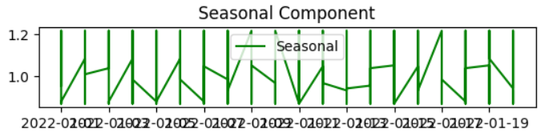

### Developed by: Shaik Shoaib Nawaz
### Register Number:212222240094
# Ex.No: 05  IMPLEMENTATION OF TIME SERIES ANALYSIS AND DECOMPOSITION
### Date: 


### AIM:
To Illustrates how to perform time series analysis and decomposition on power consumption dataset.

### ALGORITHM:
1. Import the required packages like pandas and numpy
2. Read the data using the pandas
3. Perform the decomposition process for the required data.
4. Plot the data according to need, either seasonal_decomposition or trend plot.
5. Display the overall results.

### PROGRAM:
```
import pandas as pd
import matplotlib.pyplot as plt
from statsmodels.tsa.seasonal import seasonal_decompose

data = pd.read_csv('/content/KwhConsumptionBlower78_1.csv')
data.head()

data['TxnDate'] = pd.to_datetime(data['TxnDate'], errors='coerce')
data = data.dropna(subset=['TxnDate'])
data.set_index('TxnDate', inplace=True)

data['Consumption'] = pd.to_numeric(data['Consumption'], errors='coerce')

data = data.dropna(subset=['Consumption'])

plt.plot(data['Consumption'], label='Data')
plt.title('Plotting the Data')
plt.legend()
plt.show()

period = 13
result = seasonal_decompose(data['Consumption'], model='multiplicative', period=period)

plt.subplot(4, 1, 3)
plt.plot(result.seasonal, label='Seasonal', color='green')
plt.title('Seasonal Component')
plt.legend()
plt.show()

plt.subplot(4, 1, 2)
plt.plot(result.trend, label='Trend', color='yellow')
plt.title('Trend Component')
plt.legend()
plt.show()

plt.figure(figsize=(12, 6))
plt.subplot(4, 1, 1)
plt.plot(data['Consumption'], label='original')
plt.title('Original Time Series')
plt.legend()
plt.show()
```
### OUTPUT:
#### FIRST FIVE ROWS:


#### PLOTTING THE DATA:


#### SEASONAL PLOT REPRESENTATION :


#### TREND PLOT REPRESENTATION :


#### OVERAL REPRESENTATION:


### RESULT:
Thus, The python code for the time series analysis and decomposition is executed successfully.
